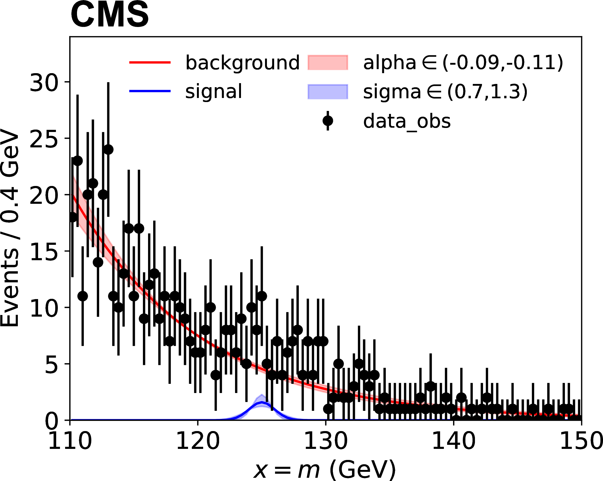

:::::::::: questions

- What does statistical inference mean?
- What is a statistical model and a likelihood?
- What types of statistical models do we use?

::::::::::

:::::::::: objectives

- Understand the role of statistical inference in an analysis and related terminology.
- Understand the concept of a statistical model and a likelihood.
- Learn the types of statistical models generally used in analyses.

:::::::::::

::: callout

## Reference Material
- [Combine Manual](https://github.com/cms-analysis/HiggsAnalysis-CombinedLimit/wiki)
- [Combine Tutorial at LPC](https://indico.cern.ch/event/747340/timetable/)
- [Practical Statistics for LHC Physicists](https://indico.cern.ch/event/358542/) - Three CERN Academic Lectures by Harrison Prosper
- [Statistics in Theory](http://indico.cern.ch/getFile.py/access?contribId=41&sessionId=1&resId=0&materialId=slides&confId=112319) - A lecture by Bob Cousins
- [RooFit](http://indico.in2p3.fr/materialDisplay.py?contribId=15&materialId=slides&confId=750) - Slides by Wouter Verkerke, one of the [RooFit](https://twiki.cern.ch/twiki/bin/view/CMS/RooFit) developers
- [RooFit Tutorials](http://root.cern.ch/root/html/tutorials/roofit/index.html) - A set of macros that showcase all major features of RooFit
- [RooStats Manual](https://twiki.cern.ch/twiki/pub/RooStats/WebHome/RooStats_UsersGuide.pdf) - A concise, clear, summary of statistics concepts and definitions
- [RooStats Tutorial](http://indico.cern.ch/getFile.py/access?contribId=0&sessionId=1&resId=0&materialId=slides&confId=118720) - Tutorial by Kyle Cranmer, one of the RooStats developers
- [RooStats Tutorials](http://root.cern.ch/root/html/tutorials/roostats/index.html) - A set of macros that showcase all major features of RooStats
- [CMS DAS 2014 Statistics Exercise](https://twiki.cern.ch/twiki/bin/viewauth/CMS/SWGuideCMSDataAnalysisSchoolStatistics2014) - A tutorial on statistics as used in CMS
- [Procedure for the LHC Higgs boson search combination in Summer 2011](https://cds.cern.ch/record/1379837) - Paper describing LHC statistical procedures
- [Combine Github](https://github.com/cms-analysis/HiggsAnalysis-CombinedLimit) - Github repository for combine
- [LPC statistics course](https://indico.cern.ch/event/653271/) - Lectures by Harrison Prosper and Ulrich Heintz, fall 2017
:::

::: callout
# Terminology and Conventions
Here we give pragmatic definitions for a few basic concepts that we will use.

- **observable** - something you measure in an experiment, for example, a particle's momentum. Often, a function of measured quantities, for example, an invariant mass of several particles.
- **global observable** or **auxiliary observable** - an observable from another measurement, for example, the integrated luminosity.
- **model** - a set of probability functions (PFs) describing the distributions of observables or functions of observables. The probability functions are called probability density functions (PDFs) if the observables are continuous and probability mass functions (PMF) if the observables are discrete. In the Bayesian approach, the model also includes the prior density.
- **model parameter** - any variable in your model that is not an observable.
- **parameter of interest (POI)** - a model parameter of current interest, for example, a cross section.
- **nuisance parameter** - every model parameter other than your parameter (or parameters) of interest.
- **data** or **data set** - a set of values of observables, either measured in an experiment or simulated.
- **likelihood** - a model computed for a particular data set.
- **hypothesis** - a model in which all quantities are specified: observables, model parameters, and prior PDFs (in case of Bayesian inference).
- **prior** - a probability or probability density for an observable or a model parameter that is independent of the data set. Priors are a key feature of Bayesian inference. However, priors can be used in frequentist inference only if they can be interpreted as relative frequencies.
- **Bayesian** - a school of statistical inference based on the likelihood and a prior.
- **frequentist** - a school of statistical inference based on the likelihood only.

:::

Statistical inference is the last step of an analysis and plays a crucial role in interpreting the experimental data. It involves using statistical methods to draw conclusions about the underlying physical processes based on observed data. This process includes defining a statistical model, constructing a likelihood function, and employing techniques such as hypothesis testing and parameter estimation to extract meaningful insights.  Let's start with the concept of a statistical model.

## Statistical model

**Statistical model** is the mathematical framework used to describe and make inferences about the underlying processes that generate observed data. It encodes the probabilistic dependence of the observed quantities (i.e. data) on parameters of the model.  These parameters are not directly observable but can be inferred from experimental data.  They include
- **parameters of interest (POI), $\vec{\mu}$:** The quantities we are interested in estimating or testing. Examples are cross section, signal strength, resonance mass, ...
- **nuisance parameters, $\vec{\nu}$:** parameters that are not of direct interest, but required to explain data.  These could be uncertainties of experimental or theoretical origin, such as detector effects, background measurements, lumi calibration, cross-section calculation.

Data are also partitioned into two:
- **primary observables, $\vec{x}$**: Appear in components of the model that contain the POIs.
- **auxiliary observables, $\vec{y}$**: Appear only in components of the model that contain the nuisance parameters.

**Likelihood** is the value of the statistical model at a given fixed set of data as a function of parameters.

Statistical model provides the complete mathematical description of an analysis and is the starting point of any interpretation.

Now let's express this mathamatically.  Our statistical model be described as $p(\rm{data,\vec{\Phi}})$ where $\vec{\Phi}$ are the model parameters.  For the sake of numerical efficiency, we can factorize it into two parts:

$$p(\vec{x},\vec{y};\vec{\Phi}) = p(\vec{x};\vec{\mu},\vec{\nu}) \prod_k p_k(\vec{y}_k;\vec{\nu}_k)$$

- **primary component:** $p(\vec{x};\vec{\mu},\vec{\nu})$.  Relates POI to primary observables.
- **auxiliary component:** $\prod_k p_k(\vec{y}_k;\vec{\nu}_k)$. Constrains nuisance parameters.

Likelihood function is constructed by evaluating $p(\rm{data,\vec{\Phi}})$ on a dataset:

$$L(\vec{\Phi}) = \prod_d p(\vec{x}_d;\vec{\mu},\vec{\nu}) \prod_k p_k(\vec{y}_k;\vec{\nu}_k)$$

where $d$ runs over all entries in data.

This likelihood can be used in both frequentist and Bayesian calculations.

## Types of statistical models

### Counting analysis

A counting analysis is one for which the statistical model has only one primary observable, namely the total event count in a single channel that includes multiple sources of signal and background. In the following, the primary observable is labeled $n$. The probability to observe $n$ events is described by a Poisson distribution,

$$p(n;\lambda(\vec{\mu}, \vec{\nu})) =\lambda^n\frac{e^{-\lambda}}{n!}$$

where the expected value, $\lambda$, can be a function of one or more parameters, and represents
the total number of expected signal and background events.

### Template shape analysis

A shape analysis is defined as one that incorporates one or more primary observables, beyond a
single number of events.  

A template-based shape analysis is one in which the observable in each channel is partitioned
into $N_B$ bins. The number of events $n_b$ in the data that fall within each bin $b$ (with $b$ running
from 1 to $N_B$) is considered as an independent Poisson process. The model becomes a product of Poisson probabilities:

$$p(x;\vec{\mu}, \vec{\nu}) = \prod_{b=1}^{N_B} P(n_b;\lambda (\vec{\mu},\vec{\nu}))$$

In a sense, this is a generalization of the counting analysis.  Template shape is the model most used by LHC analyses, as we usually do not know an analytical expression that would describe how our signal or background processes are distributed.  

Technically, input to this model is usually given as histograms.  Data, backgrounds, signals and variations on backgrounds and signals are all provided as histograms. An example can be seen in the figure below, where sigma and alpha are systematic uncertainties:

{width="50%"}

### Parametric shape analysis

A parametric shape analysis is one that uses analytic functions rather than histograms to describe
the probability distributions of continuous primary observables. 
In these cases, the primary observable $x$ in each channel can be univariate or multivariate. For example, in the measurements of Higgs boson cross sections in the four-lepton decay mode, the primary observable is bivariate composed of the invariant mass of the four leptons and a kinematic discriminator designed to separate the signal and background processes. The data in parametric shape analyses can be binned, as in the case of template-based analyses, or unbinned. Uncertainties affecting the expected distributions of the signal and background processes can be implemented directly as uncertainties in the parameters of those analytical functions.

$$p(x;\vec{\mu}, \vec{\nu}) = \sum_p \frac{\lambda_p(\vec{\mu},\vec{\nu}) f_p(x; \vec{\mu}, \vec{\nu})}{\sum_p \lambda_p(\vec{\mu}, \vec{\nu})}$$

Here $p$ stands for process and $f_p(x; \vec{\mu}, \vec{\nu})$ are the probability distribution functions for each process.  The figure below shows an example, where sigma and alpha are the uncertainties on parameters of the analytic function.

{width="50%"}

